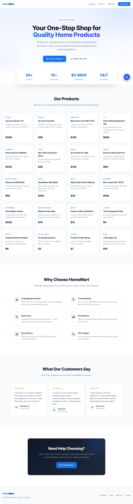

<div align="center">

# HomeMart

[](https://nodejs.org/)
[](https://expressjs.com/)
[](https://www.retellai.com/)
[](https://n8n.io/)
[](https://ai.google.dev/)

**AI-powered household products store with voice and text chat assistants**

</div>

## Screenshot



## About

HomeMart is a household products web app featuring an AI voice assistant (Alex) powered by Retell AI and a text chat assistant powered by Google Gemini. Customers can browse 20 curated household products and get personalized recommendations through natural voice or text conversations.

### Key Features

- **Voice AI Assistant** — Talk to Alex via Retell AI for real-time voice product recommendations
- **Text Chat Assistant** — Gemini-powered chat for product queries, comparisons, and suggestions
- **Product Catalog** — 20 household products from trusted brands (Dyson, Samsung, KitchenAid, etc.)
- **n8n Middleware** — Workflow automation handles Retell API calls securely
- **Responsive Design** — Works on desktop and mobile devices

## Tech Stack

| Layer | Technology |
|-------|-----------|
| **Frontend** | HTML, CSS, JavaScript |
| **Backend** | Node.js, Express.js |
| **Voice AI** | Retell AI (Web SDK + API) |
| **Text Chat** | Google Gemini 2.5 Flash |
| **Middleware** | n8n (self-hosted workflow automation) |

## Architecture

```
┌─────────────────────────────────────────────────┐
│                   Browser                        │
│  ┌───────────┐  ┌────────────┐  ┌────────────┐ │
│  │ Product   │  │ Voice Call │  │ Text Chat  │ │
│  │ Grid      │  │ (Retell SDK)│ │ (Gemini)   │ │
│  └───────────┘  └─────┬──────┘  └─────┬──────┘ │
└────────────────────────┼───────────────┼────────┘
                         │               │
                    POST /api/       POST /api/
                   create-web-call      chat
                         │               │
              ┌──────────▼───────────────▼────────┐
              │       Express.js Server            │
              │         (server.js)                │
              └──────────┬───────────────┬────────┘
                         │               │
                   n8n Webhook      Gemini API
                         │
              ┌──────────▼────────────────────────┐
              │     n8n Workflow                    │
              │  Webhook → HTTP Request (Retell)   │
              └──────────┬────────────────────────┘
                         │
              ┌──────────▼────────────────────────┐
              │     Retell AI API                  │
              │  create-web-call → access_token    │
              └───────────────────────────────────┘
```

## Project Structure

```
homemart/
├── index.html              # Main HTML page
├── main.js                 # Frontend JS (Retell SDK, products, chat)
├── styles.css              # Styling
├── server.js               # Express backend (proxy + chat API)
├── household_products.csv  # Product data source
├── package.json            # Dependencies
├── .env                    # Environment variables (not committed)
└── .gitignore              # Git ignore rules
```

## Getting Started

### Prerequisites

- [Node.js](https://nodejs.org/) 18+
- [n8n](https://n8n.io/) instance (self-hosted or cloud)
- [Retell AI](https://www.retellai.com/) account with API key
- [Google Gemini](https://ai.google.dev/) API key

### Installation

```bash
# Clone the repository
git clone https://github.com/alfredang/homemart.git
cd homemart

# Install dependencies
npm install
```

### Environment Setup

Create a `.env` file in the project root:

```env
N8N_WEBHOOK_URL=your_n8n_webhook_url
GEMINI_API_KEY=your_gemini_api_key
```

### Run

```bash
npm start
```

Open [http://localhost:3000](http://localhost:3000) in your browser.

## How It Works

1. **Browse Products** — View 20 household products with prices and descriptions
2. **Voice Chat** — Click "Talk to Alex" to start a voice conversation via Retell AI
3. **Text Chat** — Type messages to get AI-powered product recommendations via Gemini
4. **n8n Flow** — Voice calls are routed through n8n workflow for secure API key management

## Contributing

1. Fork the repository
2. Create your feature branch (`git checkout -b feature/amazing-feature`)
3. Commit your changes (`git commit -m 'Add amazing feature'`)
4. Push to the branch (`git push origin feature/amazing-feature`)
5. Open a Pull Request

## Acknowledgements

- [Retell AI](https://www.retellai.com/) — Voice AI platform
- [n8n](https://n8n.io/) — Workflow automation
- [Google Gemini](https://ai.google.dev/) — Text generation AI
- [Express.js](https://expressjs.com/) — Web framework
